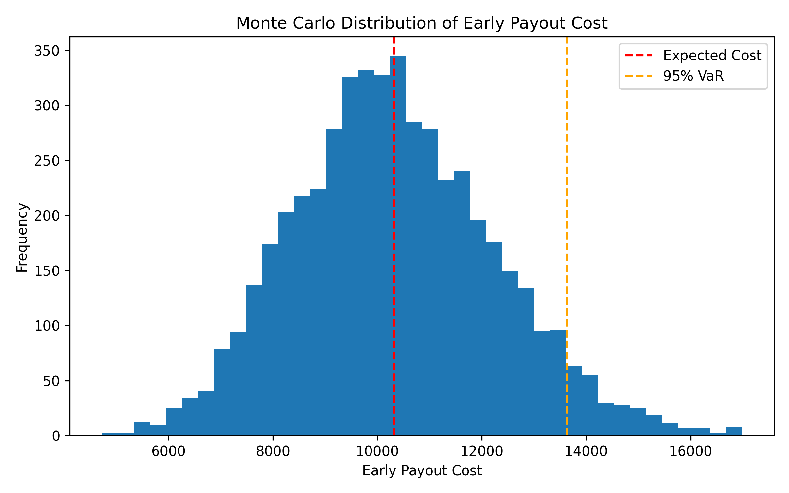
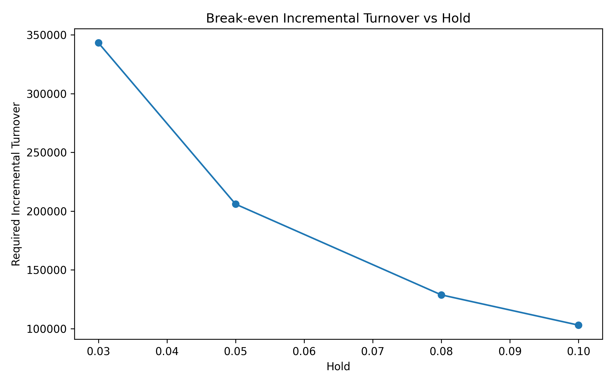

# early-payout-risk-model

## Overview

This project analyzes the financial impact of early payout promotions in sports betting markets.

The objective is to estimate the probability of early payout triggers and evaluate whether such promotions are financially viable for sportsbooks.

To do so, the project combines:

* probabilistic modeling of early payout events
* stochastic simulation of match outcomes
* an economic framework for sportsbook profitability
* a break-even analysis to determine the incremental turnover required to offset the additional cost of the promotion

The final output estimates how much additional betting activity must be generated for the promotion to remain profit-neutral.

---

# Project Objective

Sportsbooks often offer **early payout promotions**, where a bet is settled as a winner before the match ends if a certain condition is met (for example, a team leading by two goals).

While these promotions can increase customer engagement and betting volume, they introduce additional financial risk.

This project estimates:

* The probability of early payout triggers
* The probability that the favorite does not ultimately win after the trigger
* The expected financial cost of the promotion
* The incremental turnover required for the promotion to break even

---

# Methodology

The project follows four main steps.

---

## Match Simulation

Match outcomes are generated using a **Poisson-based scoring model**.

Goal events are simulated as stochastic processes over the duration of the match.
This allows the model to track the evolution of the score throughout the game.

Early payout triggers occur when:

```
favorite goals − underdog goals ≥ 2
```

at **any point during the match**, not only at full time.

This approach provides a more realistic representation of early payout promotions commonly used in football betting markets.

---

## Estimating Early Payout Probabilities

The project uses a **two-stage modeling framework**.

### Model 1 — Early Payout Trigger

The first predictive model estimates:

```
P(early payout trigger)
```

based on pre-match variables such as:

* favorite odds
* underdog odds
* expected scoring intensity (Poisson parameters)

---

### Model 2 — Comeback Probability

The second model estimates:

```
P(favorite not win | early payout trigger)
```

This captures scenarios where:

* the favorite leads by two goals during the match
* the sportsbook pays the early payout
* but the match result later changes

Examples include:

```
2–0 → early payout triggered
2–2 final score
```

This is the scenario that generates losses for the sportsbook.

---

## Economic Framework

Sportsbook profitability can be expressed as:

```
Benefit = Total Turnover − Regular Payout − Early Payout Cost
```

Where:

* **Total Turnover** represents the total amount wagered
* **Regular Payout** represents payouts to winning bets
* **Early Payout Cost** represents the additional cost generated by the promotion

---

### Base Case (Without Early Payout)

Without the promotion, sportsbook profit depends on the market hold.

Expected payout can be written as:

```
E[Regular Payout] = Total Turnover × (1 − Hold)
```

Therefore profit becomes:

```
B₀ = Total Turnover × Hold
```

This represents the standard sportsbook revenue model.

---

### Case With Early Payout Promotion

When the early payout promotion is introduced:

```
B₁ = Total Turnover₁ − Regular Payout − Early Payout Cost
```

Replacing the expected payout expression:

```
B₁ = Total Turnover₁ × Hold − Early Payout Cost
```

---

## Break-Even Analysis

The promotion is considered financially viable if it does not reduce sportsbook profitability.

Therefore we require:

```
B₁ = B₀
```

Substituting the expressions:

```
Total Turnover₁ × Hold − Early Payout Cost = Total Turnover₀ × Hold
```

Rearranging:

```
(Total Turnover₁ − Total Turnover₀) × Hold = Early Payout Cost
```

Define incremental turnover:

```
ΔTurnover = Total Turnover₁ − Total Turnover₀
```

The break-even condition becomes:

```
ΔTurnover × Hold = Early Payout Cost
```

Solving for the required incremental turnover:

```
ΔTurnover = Early Payout Cost / Hold
```

---

# Risk Estimation

The expected cost of early payout promotions is estimated using:

```
P(trigger) × P(not win | trigger)
```

This probability is applied to the exposure of each bet:

```
Cost = stake × odds × P(trigger) × P(not win | trigger)
```

To estimate the full distribution of possible outcomes, the project runs **Monte Carlo simulations**.

These simulations generate thousands of betting scenarios and estimate:

* Expected Early Payout Cost
* Loss distribution
* Tail risk scenarios (95% Value-at-Risk)

This allows the analysis to estimate both:

* expected break-even turnover
* conservative break-even turnover under extreme scenarios

---

# Technologies Used

* Python
* Pandas
* NumPy
* Scikit-learn
* Matplotlib

---

# Project Structure

```
early-payout-risk-model
│
├── src
│   ├── simulate_data.py
│   ├── model.py
│   ├── cost.py
│   ├── breakeven.py
│   └── run.py
│
├── reports
│   └── figures
│
├── requirements.txt
└── README.md
```

---

# Example Outputs

The project generates several outputs including:

* Early payout probability estimates
* Model evaluation metrics (ROC-AUC)
* Simulated cost distributions
* Break-even incremental turnover estimates

Example visualizations include:

### Early Payout Cost Distribution

Monte Carlo simulation of the cost distribution of the promotion.

### Break-even Incremental Turnover

Estimated incremental betting volume required to offset promotion costs.

---
## How to Run the Project

1. Clone the repository

git clone https://github.com/damusnazira/early-payout-risk-model.git

2. Install dependencies

pip install -r requirements.txt

3. Run the main script

python main_script.py

## Example Outputs

### Early Payout Cost Distribution



### Break-even Incremental Turnover



# Disclaimer

This project is a **generic analytical exercise using simulated data**.
It does not represent any specific sportsbook, company, or proprietary dataset.


